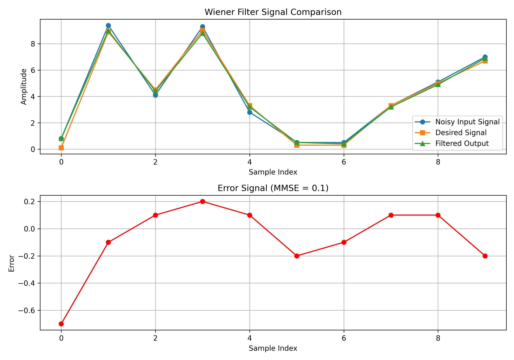
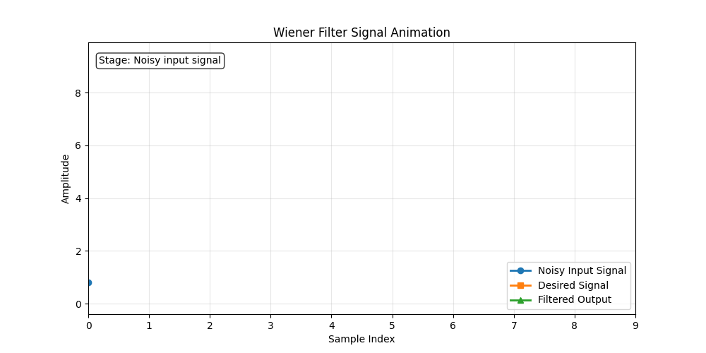

# Wiener Filter Implementation in MIPS Assembly

## Project Overview

This project implements a **Wiener filter** using **MIPS assembly language**.  
The program estimates a desired signal from a noisy input by minimizing the **Mean Square Error (MSE)** under the **Minimum Mean Square Error (MMSE)** criterion.

The implementation was developed for the **Computer Architecture Lab (CO2008)** course at **Ho Chi Minh City University of Technology (HCMUT)**.

The project demonstrates how a signal processing algorithm can be implemented at a **low-level assembly architecture**, combining concepts from **digital signal processing and computer architecture**.

---

## Key Features

- Wiener filter implementation in **MIPS assembly**
- Floating-point computation using MIPS instructions
- Autocorrelation and cross-correlation calculation
- Toeplitz matrix construction
- Linear system solving via **Gaussian elimination**
- Mean Square Error (MMSE) evaluation
- File input/output handling

---

## Problem Formulation

Given a noisy input signal:

$$
x(n) = s(n) + w(n)
$$

where:

- $s(n)$: desired signal
- $w(n)$: noise

The goal is to design a linear filter:

$$
y(n) = \sum_{k=0}^{M-1} h_k \, x(n-k)
$$

such that the **mean square error** between $y(n)$ and the desired signal $d(n)$ is minimized.

---

## Wiener Filter Theory

The Wiener filter coefficients are obtained by solving the **Wiener–Hopf equations**:

$$
\mathbf{R}_M \mathbf{h} = \boldsymbol{\gamma}_d
$$

where:

- $\mathbf{R}_M$: Toeplitz autocorrelation matrix of the input signal
- $\boldsymbol{\gamma}_d$: cross-correlation vector between desired and input signals
- $\mathbf{h}$: filter coefficient vector

The optimal filter coefficients are:

$$
\mathbf{h}_{opt} = \mathbf{R}_M^{-1} \boldsymbol{\gamma}_d
$$

The **Mean Square Error (MMSE)** is computed as:

$$
\mathrm{MMSE} = \frac{1}{M} \sum_{n=0}^{M-1} \left(d(n) - y(n)\right)^2
$$

---

---

## Signal Analysis

The following figure compares the noisy input signal, the desired signal, and the filtered output produced by the Wiener filter.



---

## Animated Filtering Process

The animation below illustrates how the Wiener filter estimates the desired signal from the noisy observation.



---

## Implementation Details

The entire Wiener filtering process is implemented in **MIPS assembly**, including:

1. Reading floating-point signals from input files
2. Computing the autocorrelation matrix
3. Computing the cross-correlation vector
4. Constructing the Toeplitz matrix
5. Solving the linear system using **Gaussian elimination**
6. Applying the Wiener filter
7. Computing the MMSE
8. Writing results to an output file

---

## Input and Output

### Input Files

- `input.txt` — noisy input signal (10 floating-point values)
- `desired.txt` — desired signal (10 floating-point values)

### Output File

`output.txt` contains:

- Filtered output signal
- Computed MMSE value

Example error handling:

```text
Error: size not match
```

---

## Algorithm Pipeline

```
Input Signals
     ↓
Autocorrelation
     ↓
Cross-correlation
     ↓
Toeplitz Matrix
     ↓
Gaussian Elimination
     ↓
Filter Coefficients
     ↓
Filtered Output
     ↓
MMSE Evaluation
```

---

## Project Structure

```
Wiener-Filter-Mips
│
├── src
│   └── wiener_filter.asm
│
├── data
│   ├── input.txt
│   ├── desired.txt
│   └── expected.txt
│
├── tools
│   └── Mars45.jar
│
├── output.txt
├── README.md
└── .gitignore
```

---

## How to Run

### 1. Open the program in MARS

Load the assembly file in the **MARS MIPS Simulator**:

```
src/wiener_filter.asm
```

### 2. Prepare input data

Place the following files in the working directory:

```
input.txt
desired.txt
```

### 3. Run the program

Execute the program using the **Run** command in MARS.

### 4. Check results

Results will appear:

- in the MARS console  
- in the file `output.txt`

---

## Technologies Used

- MIPS Assembly  
- MARS MIPS Simulator  
- Digital Signal Processing (DSP)  
- Linear Algebra  

---

## Learning Outcomes

This project demonstrates:

- Implementation of signal processing algorithms at the **assembly level**
- Matrix operations and numerical methods in **low-level programming**
- Interaction between **algorithm design and computer architecture**

---

